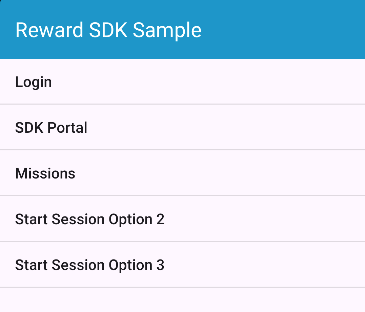

[](https://developer.android.com)
[](https://github.com/JetBrains/kotlin)
[](https://developer.android.com)

# Rakuten Reward SDK Native Sample App

---
# Introduction  
This is a sample Android app project to demonstrate the usage of the [Rakuten Reward Native SDK](https://github.com/rakuten-ads/Rakuten-Reward-Native-Android/tree/master)

# Pre-requisites   

## Branches  
We provide several SDKs for different use cases as well as different login options. Please refer to the branch description below and choose the correct branch for your use case.  

| Branch | Description | Current Branch |
| --- | --- | ---- |
| main | This is the default branch to demo the basic API usage and <code>RakuteAuth</code> login options |  |  
| login/rae | This branch is for application which uses RAE token |  |  
| **login/rid** | This branch is for application which uses RID token | ✅ |  
| feature/saas-sdk | This branch demonstrates the usage of Saas SDK |  |  
| feature/js-ext | This branch demonstrates the usage of JavaScript Extension SDK |  |  

## Secrets Gradle Plugin  
This sample app project uses Google's [Secrets Gradle Plugin](https://github.com/google/secrets-gradle-plugin).  
To build the sample app, please fill in the following key-value pairs in the `local.properties` file:   

```properties
appKey=xxx
dailyMissionCode=xxx
customMissionCode=xxx
idSdkClientId=xxx
idSdkServiceUrl=xxx
idSdkScopeMission=xxx
idSdkAudienceMission=xxx
accessTokenEndPoint=xxx
```  
If you already have the App Key and Mission Code, please input the values.  
If you still don't have these values, please send a request to Reward SDK team.  

# Sample App  
  

Above is the screenshot of the sample app. To test the API, you are required to log in first.  
If you have logged in, there will be a toast message saying `Reward SDK in ONLINE`.  

| Menu | Description |
| --- | --- |
| Login | Demo login using Rakuten Login SDK |  
| SDK Portal | Demo `RakutenReward.openSDKPortal` API |  
| Missions | Demo mission-related API including `logAction` |  
| Start Session Option 2 | Demo Option 2 of Start SDK session [guide](https://github.com/rakuten-ads/Rakuten-Reward-Native-Android/blob/master/doc/basic/README.md#option-2-call-lifecycle-method-in-each-android-lifecycle) |  
| Start Session Option 3 | Demo Option 3 of Start SDK Session [guide](https://github.com/rakuten-ads/Rakuten-Reward-Native-Android/blob/master/doc/basic/README.md#option-3-call-androidx-base-lifecycle-method) |  
